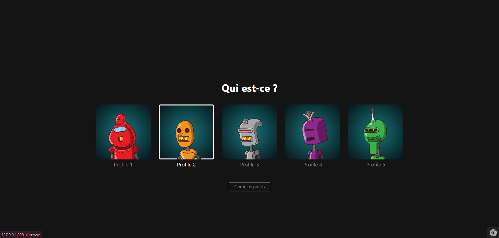
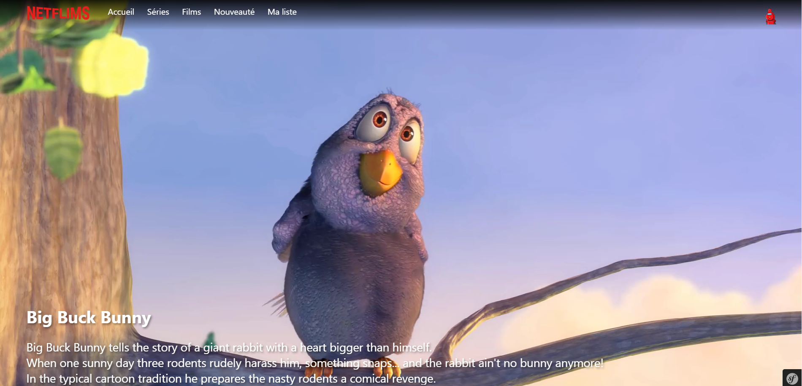
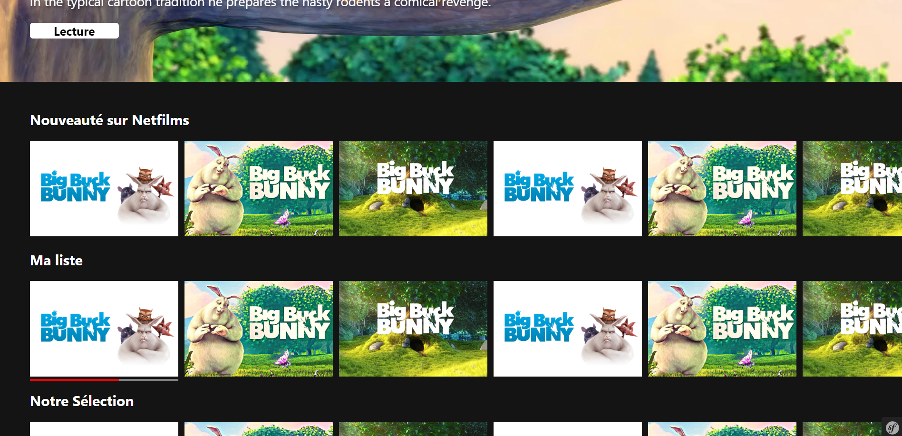

# Netfilms

Ce projet est une tentative de reproduction de la plateforme de streaming "Netflix" en utilisant le framework Symfony. L'objectif principal de ce projet est de continuer à me perfectionner en Symfony et d'acquérir une meilleure compréhension de ses fonctionnalités et de son architecture.

## Screenshots

## Authors

- [@Ugur-F](https://github.com/Ugur-F)
